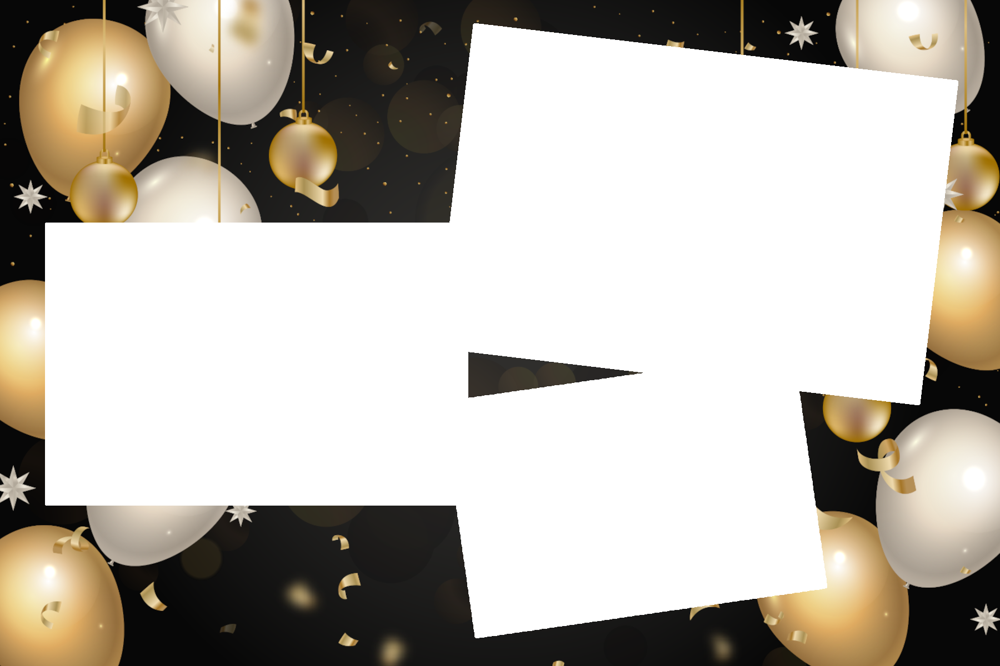

# Meng Fotobox by B. Cloos

This page shows my DIY-project of a photobooth.

## Information

*MengFotobox* is a private DIY project of Ben Cloos. The project consists of a DYI photobooth, parties, marriages, birthdays, hollidays or other events. 
This project was started in 2018. Professional Photobooths for such events are usually costly, although very easy to handle.
The goal of this project is, to create a low-cost, photobooth station, where the only recurring costs would be the photopaper for when pictures want to be printed out directly.

## MengFotobox1.0

In the beginning of this project, the first approach was very simple. The used hardware was the following:
* Laptop with the software [DSLRBooth](https://dslrbooth.com/)
* DSLR Camera (in this case NikonD5100)
* Cables

The laptop was put on a high table, the camera behind it on a tripod. Very easy setup.

## MengFotobox2.0

In this version of the project, the processing unit of the photobooth was changed completely. The Laptop was changed with an iPad Mini.
Hard- and Software:
* iPad Mini with the software [WiFiBooth](https:www.wifibooth.com)
* DSLR Camera (in this case [Canon 7Dmkii](https://www.canon.de/for_home/product_finder/cameras/digital_slr/eos_7d_mark_ii/))
* Cables
* Aluminium Box, with cutouts for iPad and DSLR inside -> [Link](https://www.printables.com/model/64961-diy-photobooth) 
* Softbox Lights from Neewer --> [Link](https://www.amazon.de/-/en/gp/product/B01CVGWALM/ref=ppx_yo_dt_b_search_asin_title?ie=UTF8&psc=1)

This version of *MengFotobox* worked well for several years, until some iPadOS and the age of the iPad made the system really slow. 

## MengFotobox3.0 (current setup)

In April 2023, the next version of *MengFotobox* started development. 
iPads are expensive, even when they are bought used, so the decision was made to change to a computer-based system. The software [Sparkbooth](https://sparkbooth.com/) offers a comnputer-based solution as a photobooth application.
Although the application is not cheap at a pricetag of 150€ for the DSLR version, this software was the most suiting one, because of the one-time fee. Furthermore the Photobooth was extended by a photoprinter from Canon. 

### Hardware

* Canon Eos RP mirrorless camera
* Canon 24-70mm f/4 L-series or Canon 50mm f/1.8 
* [Neewer Softlights](https://www.amazon.de/-/en/gp/product/B01CVGWALM/ref=ppx_yo_dt_b_search_asin_title?ie=UTF8&psc=1)
* Tripod
* Canon Selphy CP1500 Photo printer

### Layouts

Sparkbooth offers the possibility to choose different picture styles and layout for your event.
I created some layouts with some optios for different occasions. The Layouts always have a corresponding .txt file, where attribution for used graphics are marked.

All Layouts can be found in github under [assets](https://github.com/Benemenn/mengfotobox/tree/gh-pages/assets/images/photoLayouts)

The layouts can be determined easily `<number_of_photos>_<rotation>_<name_of_Design>.png`

Here are some examples. The grey areas will be filled with the photos taken by the photobooth.

#### 1 Landscape simple Birthday

#### 3 Landscape Birthday

If you have more ideas for nice designs, feel free to contact me at [mengfotobox@gmail.com](mailto:mengfotobox@gmail.com)

# How-To 

This section will describe the steps that are needed to set up the photobooth at your event, in case Ben is not there to do if for you!

## Hardware

Please make sure, that you have gotten all the necessary hardware from Ben!

### For *MengFotobox*2.0 (iPad):
* iPad Mini with the software [WiFiBooth](https:www.wifibooth.com)
* Canon 7D mk2 Camera
* Charging block for the camera
* Charging cable and Power Supply for the iPad
* Aluminium Box
* Softbox Lights

### For *MengFotobox*3.0 (Computer-based)
* Computer -> Ben's MacBook Pro
* Canon EOS RP Camera
* Charging block for the camera
* 3 USB-C to USB-C cables
* Power Cables for charging the mac
* Tripod 
* Softbox Lights

#### 1. Set up the hardware

- Make sure that all the needed hardware is there, if not, please contact Ben via [mail](mailto:mengfotobox@gmail.com) or mobile phone!
- Set up the Laptop on a high Table
- Set up the Camera on a tripod and put it behind the Laptop
- if you have the photo printer, set it up near the Laptop
- Connect the Laptop to Power
- Connect the Camera via USB-C to the Laptop

##### Lights 
- Unpack the lights
- Extend the tripods
- Take the Lightbulbs
- Open the umbrellas, push the middle part over the socket of the bulb
- Screw in the lightbulbs
- Pull the white cloth over all 4 edges of the umbrella
- Mount the umbrella on top of the tripod, be sure to fasten the screws firmly
- adjust the height of the lights as needed!

#### 2. Set up the software

- Power on the Laptop and the camera (wheel on the right side of the camera)
- On the Laptop choose BOOTCAMP/WINDOWS on startup (Ben will have provided you with the access code)
- Connect the Laptop to the internet (if possible)
- Open the software **Sparkbooth** by double-clicking on the yellow icon on the left side.
- The software should recognize the camera directly

#### 3. Set up the printer (optional)

For the printer to work, the Laptop and the printer must be connected to the same internet network. *Please be aware that Ben will **provide** the paper for the photos, but is happy to get **financial support** for these recurring expenses.*

- connect the printer to power
- insert the photo tray (see manual if needed)
- hold the on button to power the printer on
- connect the printer to the same internet network as the laptop, by accessing the WiFi settings

The Laptop should recognize the printer automatically, as this printer is setup to be the default photo printer.

#### 4. Have fun!

Normally, Ben has made all necessary settings regarding your event, respecting your wishes.

Your photos can be printed and sent via email!

Most importantly, **HAVE FUN**

# Troubleshooting / Problem solving

If you don't know what to do, please do not try around, but contact Ben!